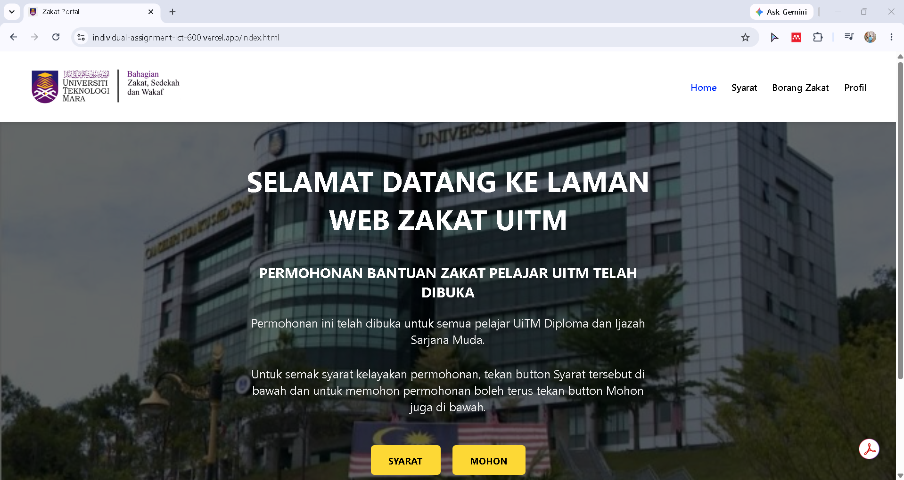
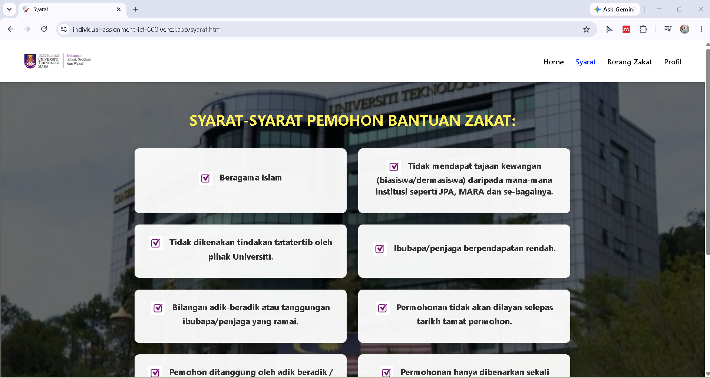
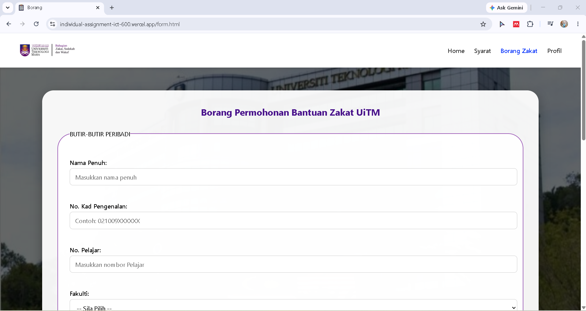
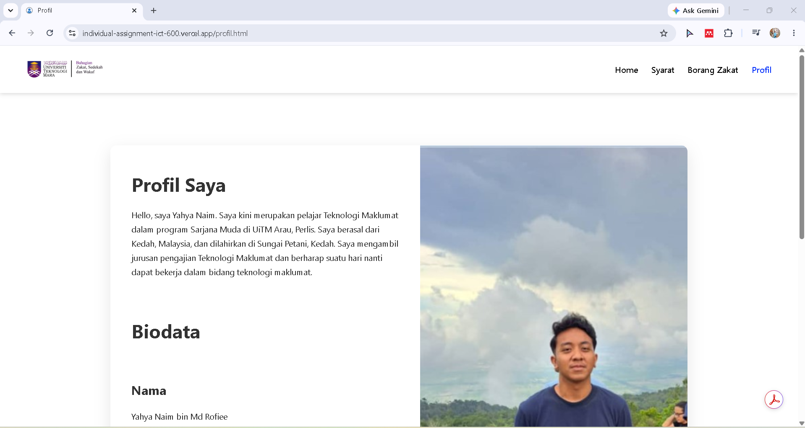

# 🎓 UiTM Zakat Application Website

A responsive web-based application developed as an individual assignment for **ICT600 - Web Technology and Applications**.

This project simulates an online zakat application system for Universiti Teknologi MARA (UiTM) students. It provides information about zakat assistance, eligibility requirements, an online application form, and a student profile page through a simple and user-friendly interface.

---

## 📌 Project Overview

The objective of this project is to develop a responsive website that allows students to:

- Learn about UiTM Zakat assistance
- Read application requirements
- Submit zakat application details through an online form
- View applicant profile information
- Navigate between pages with a clean user interface

This project was developed to strengthen front-end web development skills using HTML, CSS, and JavaScript.

---

## ✨ Features

### 🏠 Home Page
- Welcome page
- Introduction to UiTM Zakat assistance
- Navigation menu
- Quick access buttons

### 📋 Eligibility Requirements
- Displays zakat application requirements
- Provides guidance before application

### 📝 Zakat Application Form
- User-friendly application form
- Student information input
- Form validation using JavaScript

### 👤 Profile Page
- Displays applicant profile information
- Simple profile layout

### 📱 Responsive Design
- Responsive navigation bar
- Mobile-friendly layout
- Clean interface

---

## 🛠️ Technologies Used

| Technology | Purpose |
|------------|---------|
| HTML5 | Website structure |
| CSS3 | Styling and layout |
| JavaScript | Form validation and interaction |

---

## 📂 Project Structure

```
IndividualAssignment_ICT600/
│
├── images/
│   ├── home.png
│   ├── syarat.png
│   ├── borang.png
│   └── profil.png
│
├── index.html
├── syarat.html
├── form.html
├── pengesahan.html
├── profil.html
│
├── style.css
├── syaratstyle.css
├── formstyle.css
├── profilstyle.css
│
├── formscript.js
└── README.md
```

---

## 📷 Screenshots

### 🏠 Home Page



---

### 📋 Eligibility Requirements



---

### 📝 Zakat Application Form



---

### 👤 Profile Page



---

## 🎯 Learning Outcomes

Throughout this project, I gained practical experience in:

- Developing multi-page websites
- Creating responsive layouts using CSS
- Implementing JavaScript for form validation
- Designing user-friendly interfaces
- Organizing website file structures
- Applying basic front-end development best practices

---

## 🚀 Future Improvements

Possible enhancements for this project include:

- Database integration (MySQL)
- User authentication and login system
- Online document upload
- Admin dashboard
- Application status tracking
- Laravel framework implementation
- Responsive improvements using Bootstrap

---

## 👨‍💻 Author

**Yahya Naim bin Md Rofiee**

Bachelor of Information Technology (Hons.)  
Universiti Teknologi MARA (UiTM)

---

## 📄 Disclaimer

This project was developed for academic purposes as part of the ICT600 course at Universiti Teknologi MARA (UiTM). It is intended solely for learning and demonstration purposes and is not an official UiTM Zakat application system.
